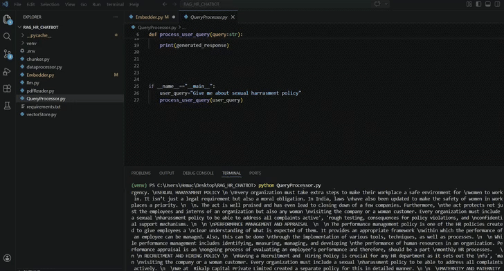

# 🤖 HR RAG Chatbot

[](https://www.python.org/)  
[](https://github.com/hemachithrav/HR-RAG-CHATBOT/issues)  
[](LICENSE)  
[]()


## 🎬 Demo

 


---

## 🚀 Project Overview

The **HR RAG Chatbot** is an AI-powered **Retrieval-Augmented Generation (RAG)** chatbot designed for **HR use cases**.  
It intelligently answers HR-related queries by combining **contextual document retrieval** with **Gemini LLM generation**, ensuring **accurate, context-aware answers**.

**Technologies used:**

- 🌐 **Gemini Embeddings (`gemini-embedding-001`)** for vectorizing queries and documents  
- ⚡ **Pinecone** for fast vector search  
- 🤖 **Gemini-2.5-flash LLM** for natural, human-like responses  
- 🧩 **RAG pipeline** for combining retrieval + generation  

---

## 🌟 Features

- 🔍 **Contextual Question Answering** based on HR documents and policies  
- ⚡ **Fast retrieval** of top matching document chunks  
- 🤖 **AI-generated responses** with Gemini LLM  
- 🛡️ **Secure**, sensitive keys stored in `.env` (not in repo)  
- 🧩 **Easy to extend** by adding new HR documents  

---

## 🛠️ Installation & Setup

**Clone the repository**
```bash
git clone https://github.com/hemachithrav/HR-RAG-CHATBOT.git
cd HR-RAG-CHATBOT


